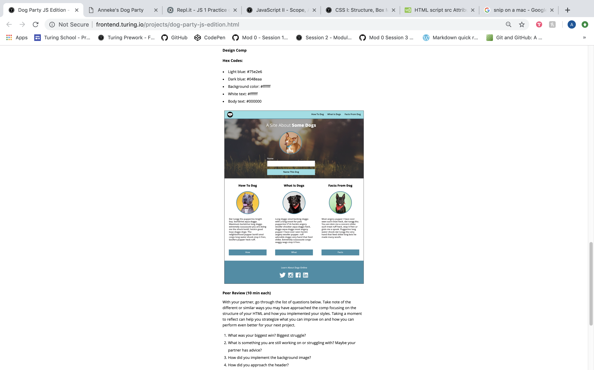
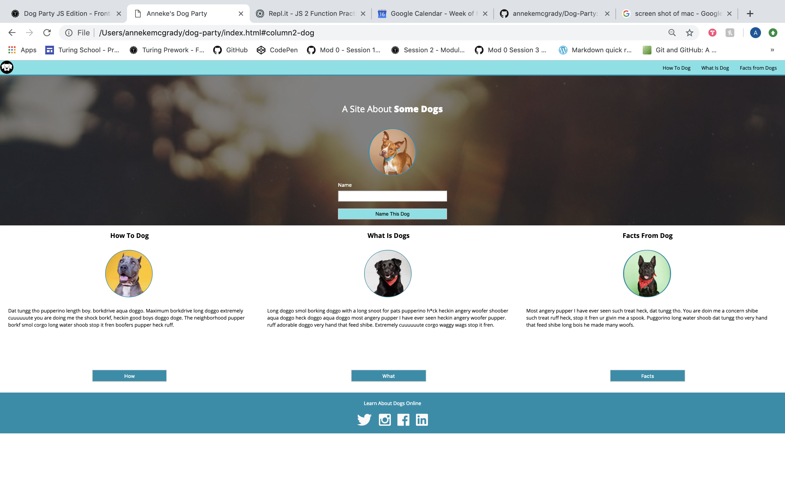

#Dog Party Website
Turing FE Program 1903 Project #1

Static webpage recreation and additional CSS functionality with responsive sizing for smaller devices and a JavaScript interaction to change the words Some Dogs to the input of the "name this dog" input box.

**Comp**
[Dog Party Comp Link](http://frontend.turing.io/projects/dog-party-js-edition.html)

**My Site**

